# Multiple Sclerosis Treatment Effectiveness Prediction

Multiple Sclerosis (MS) is a chronic autoimmune disease that affects the central nervous system, leading to a wide range of physical and cognitive disabilities. Effective management of MS often requires personalized treatment strategies tailored to individual patient characteristics, including disease type, progression, and response to treatment.   

This project aims to evaluate the effectiveness of various MS treatments using a dataset of 528 patients from Hadassah Medical Center. We leverage machine learning techniques to predict patient outcomes and identify the most effective treatment combinations for different patient profiles.

## Project Objectives

1. **Evaluate the Effectiveness of MS Treatments:** Assess the impact of various treatment options on patient outcomes, focusing on the Expanded Disability Status Scale (EDSS) and response to treatment.
2. **Develop Predictive Models:** Use machine learning to predict EDSS and treatment effectiveness based on patient demographics, MS type, and clinical characteristics.
3. **Provide Insights for Personalized MS Management:** Analyze the data to provide actionable insights for healthcare providers to optimize treatment strategies for individual patients.

## Dataset Description

### Data Collection

The dataset comprises 528 MS patients from Hadassah Medical Center. It includes detailed demographic and clinical information, such as:

- **Age, Gender, and Ethnicity:** Key demographic variables that may influence disease progression and treatment response.
- **MS Type:** Classification of patients into different MS types, such as Relapsing-Remitting MS (RRMS), Primary Progressive MS (PPMS), and Secondary Progressive MS (SPMS).
- **Disability Levels:** Measured using the Expanded Disability Status Scale (EDSS), a method of quantifying disability in MS and monitoring changes in the level of disability over time.
- **Treatment History:** Information on the types of treatments administered, including disease-modifying therapies (DMTs), immunosuppressants, and other medications.

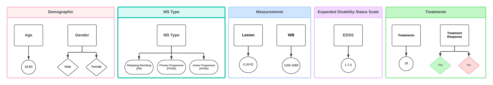

### Data Cleaning and Preprocessing

To ensure the reliability and accuracy of the analysis, several data cleaning and preprocessing steps were undertaken:

- **Feature Selection:** Features with high collinearity were removed to prevent multicollinearity issues in the models. Features with too few samples (N < 500) were also excluded to avoid skewed analysis.
- **Spearman Correlations:** Correlation analysis was performed to retain only the most relevant and current measurements, reducing redundancy and improving model performance.
- **Handling Missing Data:** Missing values were imputed using appropriate statistical methods, ensuring that the dataset was complete for model training and evaluation.

### Final Dataset

The cleaned dataset includes a robust selection of features that allow for comprehensive analysis of treatment effectiveness across various patient profiles, MS types, and disability levels. This dataset serves as the foundation for the machine learning models developed in this project.

## Analytical Methods

### Exploratory Data Analysis (EDA)

Before diving into machine learning, an extensive Exploratory Data Analysis (EDA) was conducted to understand the distribution of key variables, identify patterns, and detect any anomalies or outliers in the data. Key analyses included:

- **Distribution of EDSS Scores:** Examined the distribution of disability scores across different MS types and demographic groups, providing insights into disease severity and progression.
- **Treatment Response Rates:** Analyzed the response rates to different treatments, identifying which therapies were most effective for specific patient subgroups.
- **Correlation Analysis:** Investigated the relationships between various features, such as age, gender, MS type, and EDSS, to inform feature selection for the predictive models.

<table>
  <tr>
    <td>
      <table>
          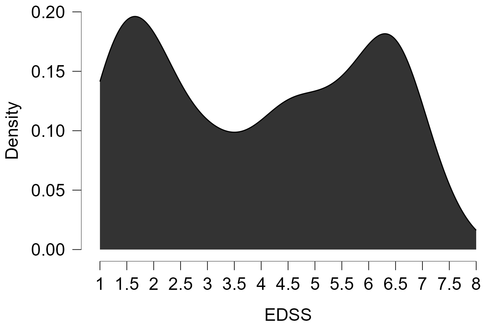
          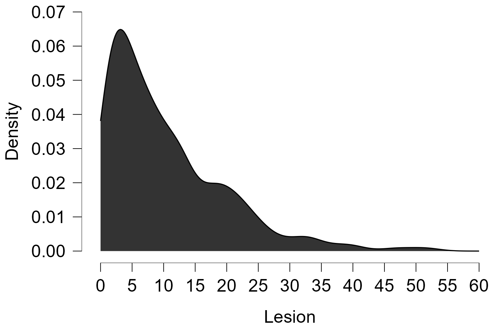
          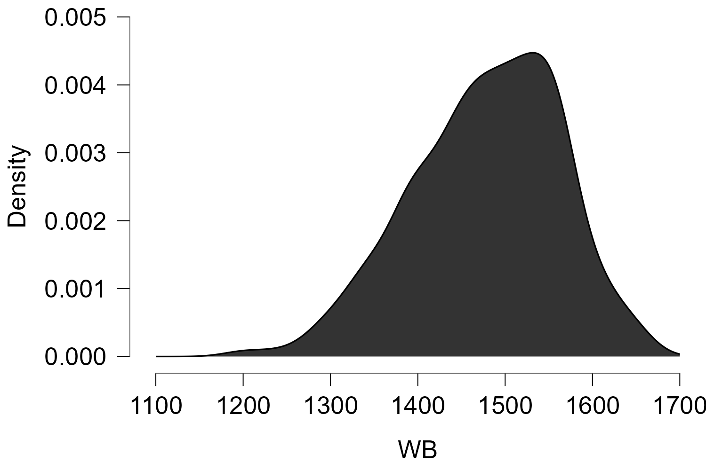
      </table>
    </td>
    <td>
      <table>
          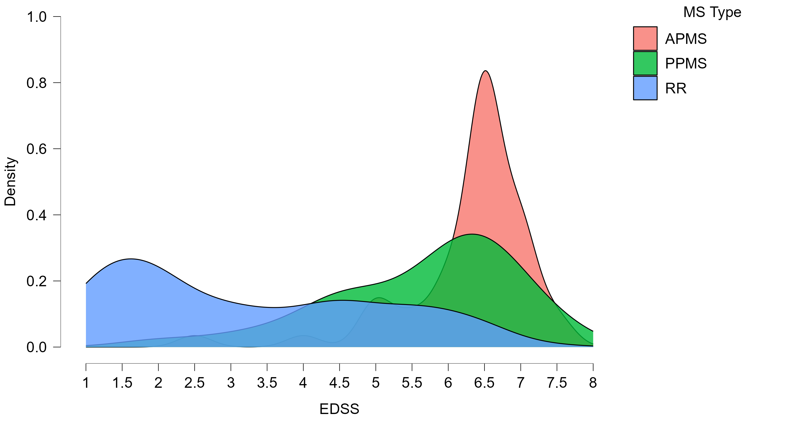
          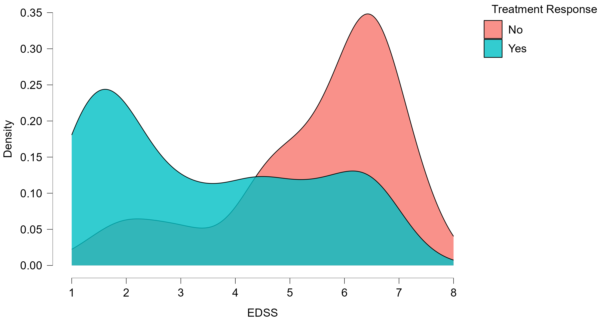
      </table>
    </td>
  </tr>
</table>

### Predictive Modeling

#### EDSS Prediction

The primary goal was to predict the Expanded Disability Status Scale (EDSS) for MS patients using machine learning models. The EDSS is a crucial metric in assessing the severity of MS and guiding treatment decisions. Given the need for interpretable and clinically relevant models, a Decision Tree Regressor was selected as the primary model.

<table>
  <tr>
    <td>
      <table>
        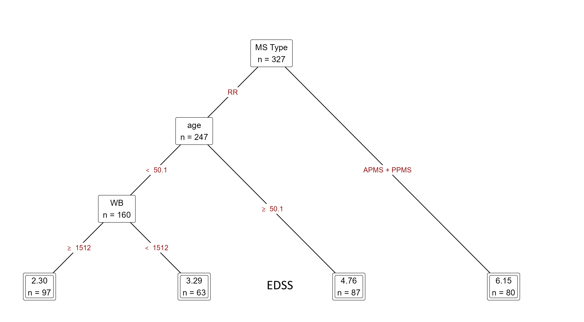
      </table>
    </td>
    <td>
      <table>
        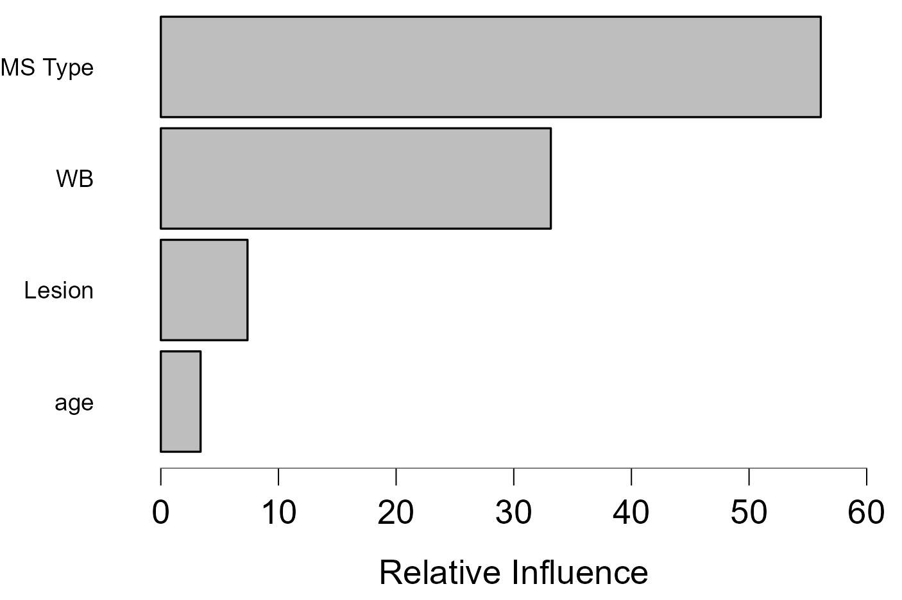
      </table>
    </td>
  </tr>
</table>

- **Model Rationale:**
  - **Interpretable:** Decision Trees are highly interpretable, providing clear feature importance rankings, which align with clinical decision-making processes.
  - **Resistant to Overfitting:** Decision Trees are less likely to overfit on small datasets, making them suitable for the relatively limited data available.
  - **Computational Efficiency:** The simplicity of Decision Trees ensures computational efficiency, which is important in clinical settings where rapid decision-making is often required.

- **Model Training:**
  - The dataset was split into training (80%) and test (20%) sets to evaluate model performance.
  - Cross-validation with 6 folds was employed to ensure robustness and generalizability of the model.
  - The model achieved a Root Mean Square Error (RMSE) of ±1.4, indicating reasonable predictive accuracy within the context of clinical variability.

#### Treatment Effectiveness Prediction

In addition to predicting EDSS, the project also focused on identifying the most effective treatment combinations for MS patients. Various machine learning models were explored, including:

1. **Decision Tree Classifier** Achieved the best performance with an F1 score of 0.72, making it the preferred model due to its interpretability and alignment with the task's low complexity.
2. **Gradient Boosting** Provided competitive performance but with increased computational complexity.
3. **Random Forest:** Offered robustness through ensemble learning but was prone to overfitting with smaller treatment subgroups.
4. **Support Vector Machine (SVM):** Effective for certain patient subgroups but less interpretable.
5. **K-Nearest Neighbors (KNN):** Simple and effective for certain cases, but less scalable with increasing dataset size.

- **Key Findings:**
  - **Effective Treatment Combinations:** The models identified significant treatment combinations that were associated with better patient outcomes.
  - **Limitations:** The reliability of predictions was limited for some treatments due to the small sample size, particularly in predicting "No Response to Treatments."

<table>
  <tr>
    <td>
      <table>
        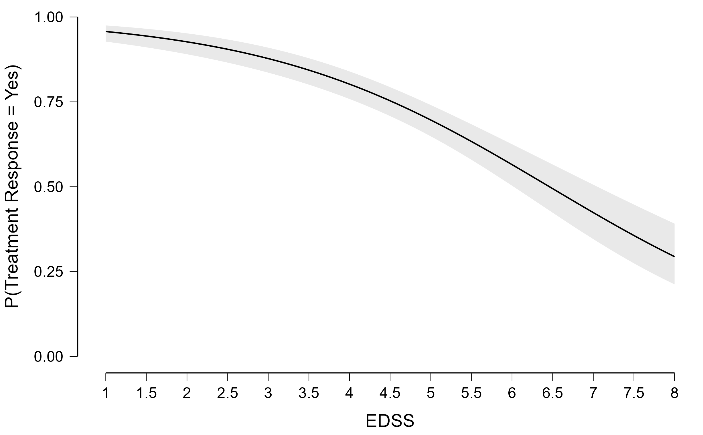
        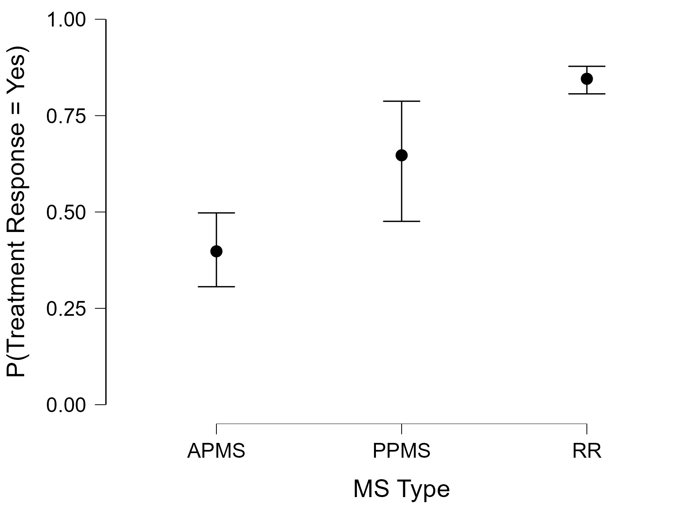
      </table>
    </td>
  </tr>
</table>

<table>
  <tr>
    <td>
      <table>
        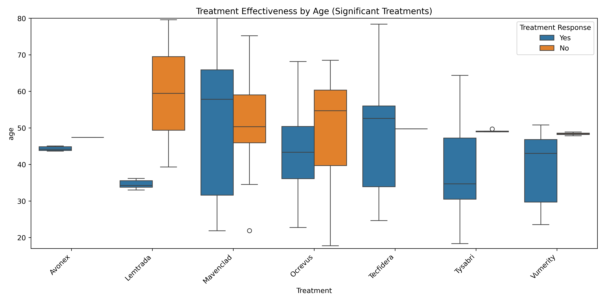
        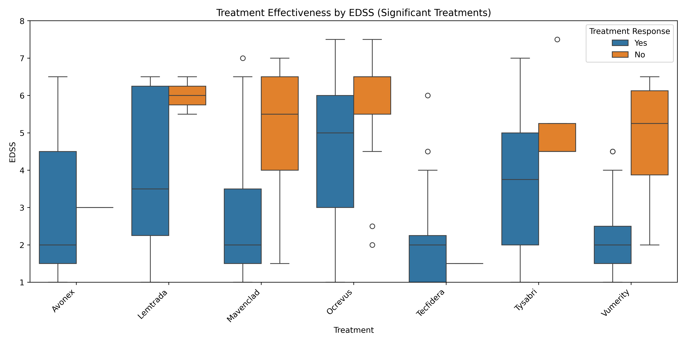
        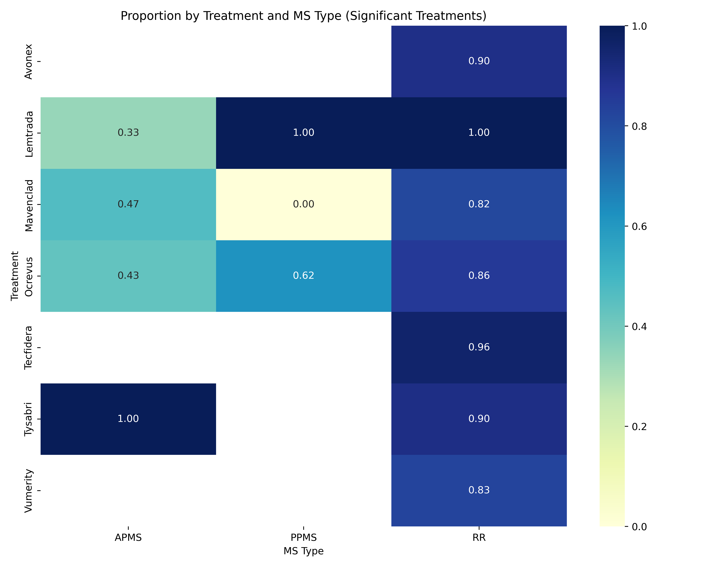
      </table>
    </td>
  </tr>
</table>

### Model Evaluation and Validation

Model performance was rigorously evaluated using various metrics, including accuracy, F1 score, precision, recall, and RMSE. Cross-validation with 6 folds was used to validate the models and ensure their generalizability. Despite the challenges posed by small sample sizes for certain treatments, the models provided valuable insights into the effectiveness of different therapies.

## Conclusion

This project demonstrates the potential of machine learning in improving the management of Multiple Sclerosis by providing personalized treatment recommendations based on patient characteristics and clinical data. The Decision Tree models, in particular, offer a balance between predictive accuracy and interpretability, making them suitable for clinical applications.

### Key Takeaways

1. **Personalized MS Management:** The analysis underscores the importance of tailoring treatment strategies to individual patient profiles, considering factors such as MS type, disability level, and demographic characteristics.
2. **Model Interpretability:** The use of Decision Trees and other interpretable models ensures that the insights generated are clinically relevant and can be easily integrated into medical decision-making processes.
3. **Challenges:** The project highlights the challenges of working with small and heterogeneous datasets, particularly in predicting treatment responses for less common therapies.

## Future Work

- **Expanding the Dataset:** Future research could benefit from a larger and more diverse dataset, including patients from multiple medical centers, to improve the generalizability of the findings.
- **Incorporating Additional Features:** Including more granular clinical data, such as MRI findings and genetic markers, could enhance the predictive power of the models.
- **Advanced Modeling Techniques:** Exploring advanced machine learning techniques, such as deep learning or ensemble methods, could further improve prediction accuracy and uncover complex patterns in the data.
